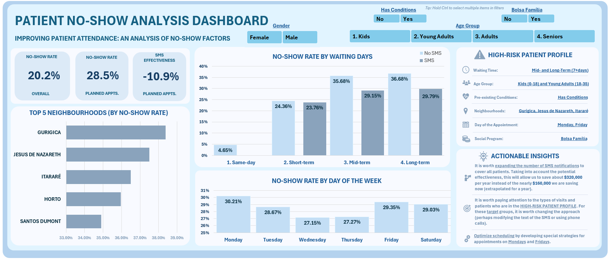

# 🏥 Patient No-Show & Financial Analysis (Excel)

### 📊 Project Overview
Analysis of 100k+ medical appointments to identify revenue loss from no-shows.

### 🛠 Tech Stack
*   **Excel Power Query:** For merging and cleaning data.
*   **Pivot Tables:** For aggregation.
*   **Visualization:** Interactive Dashboard with Slicers.

### 📂 Project Files
*   **[📄 View Dashboard & Analysis(PDF)](noshow_analysis_rec.xlsx)** - *Excel file with analysis and interactive dashboard*
*   **[📄 View Presentation (PDF)](report.pdf)** - *Short presentation(pdf)*
*   **[📄 View Raw Data (csv)](Data/noshow_raw_data.csv)** - *Source file with the data.*

### 🖼️ Project Visuals

#### 1. Interactive Dashboard
*(Shows the final output for business users)*

#### 2. ETL Process (Power Query)
*(Data before and after cleaning and transformation)*
**BEFORE**

**AFTER**

---
*Created by Oleksii Topal*
